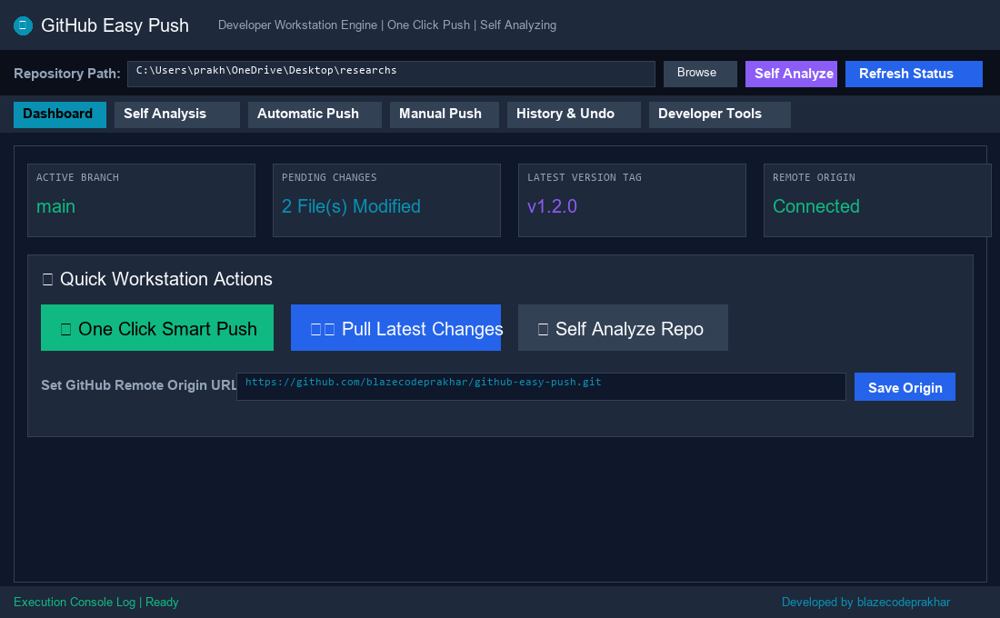
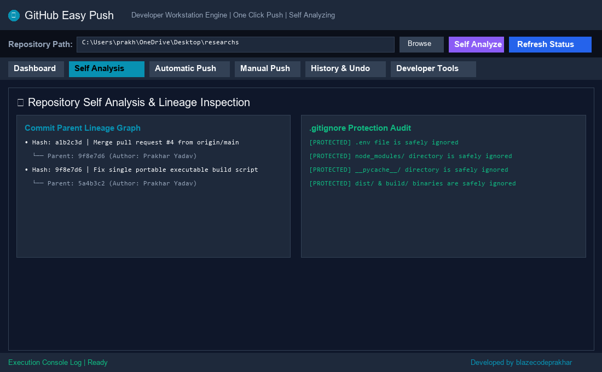
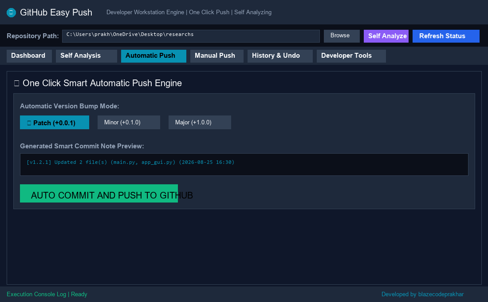
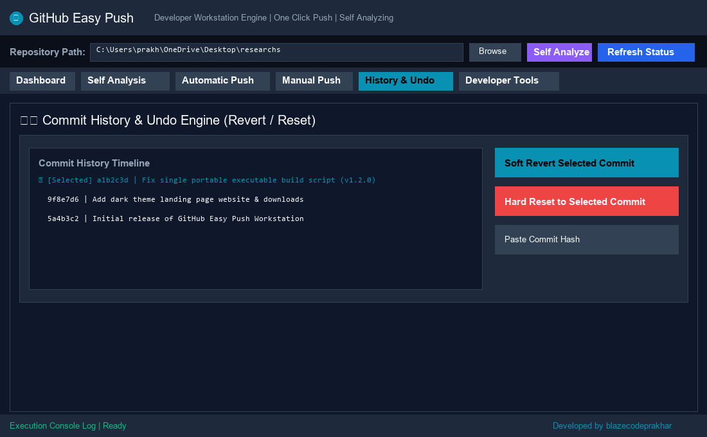
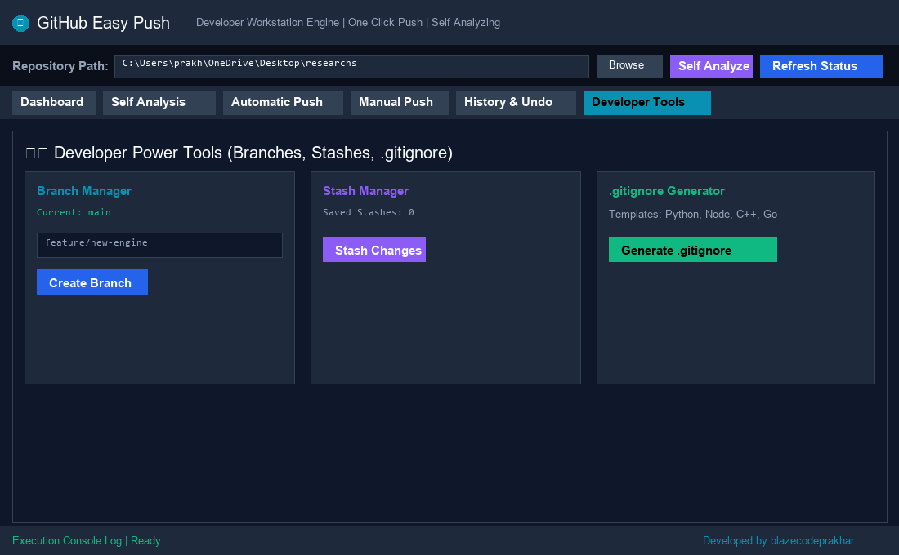

# GitHub Easy Push

<p align="center">
  
</p>

<p align="center">
  <b>Futuristic Windows Git Workstation & Automated Commit Engine</b><br>
  Developed by <b>Prakhar Yadav (<a href="https://github.com/blazecodeprakhar">@blazecodeprakhar</a>)</b>
</p>

---

## ⚡ Overview

GitHub Easy Push is a powerful desktop software utility designed to automate Git workflows, commit formatting, semantic version tagging, and repository self analysis for Windows developers.

---

## 📸 Interface Screenshots

### 1. Main Dashboard & Workstation Overview


### 2. Workspace Self Analysis Engine


### 3. One Click Smart Automatic Push


### 4. Commit History Timeline & Soft Undo Engine


### 5. Developer Power Tools & .gitignore Generator


---

## 🌟 Key Features

* **One Click Smart Auto Push**: Automatically scans file diffs, generates timestamped update notes, stages files, tags versions, and pushes to remote GitHub origins in 1 click.
* **Commit Undo Engine**: Perform Soft Revert (creates inverse commit while keeping local edits) or Hard Reset (restores repository state strictly back to target commit hash).
* **Self Analyzing Engine**: Deeply inspects Git repositories, commit parent lineage graphs, .gitignore rule protection for sensitive files, and sync health.
* **Semantic Version Bumper**: Automatic calculation and tagging for Patch (+0.0.1), Minor (+0.1.0), and Major (+1.0.0) releases.
* **Portable Windows Executable**: Single standalone `.exe` binary that runs anywhere on Windows without Python installation.

---

## 🚀 Quick Start Guide

### Direct Executable Execution
Download `GitHub_Easy_Push.exe` and double click to run instantly on Windows 10 or 11.

### Running from Source Code
```bash
git clone https://github.com/blazecodeprakhar/github-easy-push.git
cd github-easy-push
pip install -r requirements.txt
python main.py
```

### Compiling Standalone Binary (.exe)
```bash
python build_exe.py
```

---

## 📜 Documentation & Downloads

* **Official PDF Guide**: Download `Software_Guide.pdf` for complete offline instructions.
* **Web Documentation**: Visit `index.html`, `guide.html`, and `docs.html` for interactive documentation and search center.

---

## 👤 Author Profile

* **Developer**: Prakhar Yadav
* **GitHub**: [blazecodeprakhar](https://github.com/blazecodeprakhar)
* **Portfolio**: [blazecodeprakhar.netlify.app](https://blazecodeprakhar.netlify.app)
* **License**: MIT Open Source License
